<!-- .slide: class="title-slide" -->


# Neue KI-Tools in unserem Werkzeugkasten 

Show & Tell 

--

<blockquote class="pull-quote">
<p>It takes care and careful engineering to produce good results. One must work to keep the models within the flight envelope. One has to carefully structure the problem, provide the right context and guidance, and give appropriate tools and a good environment. One must think about optimizing the context window; one must be aware of its limitations.</p>
<p class="cite"><a href="https://nikomatsakis.github.io/rust-project-perspectives-on-ai/all-comments.html#tc">Rust Project Perspectives on AI</a></p>
</blockquote>

--

<blockquote class="pull-quote">
<p>Something that might not be obvious is how much things have changed over the last 2-3 months. At one time, it was hard to justify the use of models for serious work. But the state-of-the-art models are now too good to ignore.</p>
<p class="cite"><a href="https://nikomatsakis.github.io/rust-project-perspectives-on-ai/all-comments.html#tc">Rust Project Perspectives on AI</a></p>
</blockquote>

--

## Agenda

- Bugs fixen. <!-- .element: class="fragment" -->
- Kleinere Features bauen. <!-- .element: class="fragment" -->
- Maintenance durchführen. <!-- .element: class="fragment" -->
- Den Vibe coden? <!-- .element: class="fragment" -->
- Und was sind jetzt diese Agenten? <!-- .element: class="fragment" -->

---


## Bugs fixen

--

<blockquote class="pull-quote prompt">
<p>Wir haben folgendes Problem, das wir beheben möchten. Die Ausgaben, die wir aus diesem Programm machen, werden in einer Staging-Umgebung angezeigt, die einen Ersatz-Code für ESI nutzt und in Production, wo der ESI Dienst von fast.ly zur Verfügung gestellt wird. Da wir scheinbar in keinem Fall einen Header mit einem Charset mitliefern, verthalten sich beide Plattformen unterschiedlich. Staging geht von Latin-1 aus und rendert falsche Zeichenfolgen, in Production geht fast.ly von UTF-8 aus und das Rendering stimmt. Wir möchten immer einen Header mit liefern, der auf UTF-8 lautet.</p>
</blockquote>

--

Ich habe jetzt genug Kontext. Die Analyse zeigt, dass SvelteKit den Header in der Theorie korrekt setzt, aber die sicherste und zuverlässigste Fix-Stelle ist `hooks.server.js` – da läuft ohnehin jede Request durch.

--

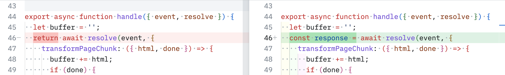
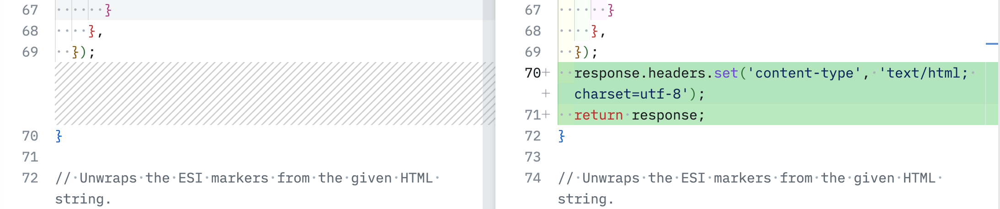

--

### Test schreiben?

--

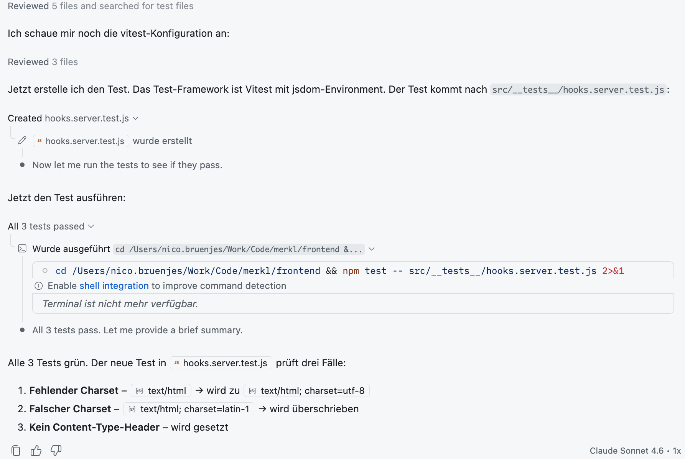

--

### Tests schreiben (überwachen)

- Immer, immer, immer die anderen Tests im Projekt als Referenz angeben
- Auf das Mocking achten (ist sehr beliebt bei LLMs, aber oft nicht nötig oder sogar kontraproduktiv)

--

Aus der `copilot-instructions.md`:

- Write unit tests for components using Vitest and Testing Library
- Test component behavior, not implementation details
- Use Playwright for end-to-end testing of user workflows
- Mock SvelteKit's load functions and stores appropriately
- Test form actions and API endpoints thoroughly
- Implement accessibility testing with axe-core

---

<div class="r-stack">
	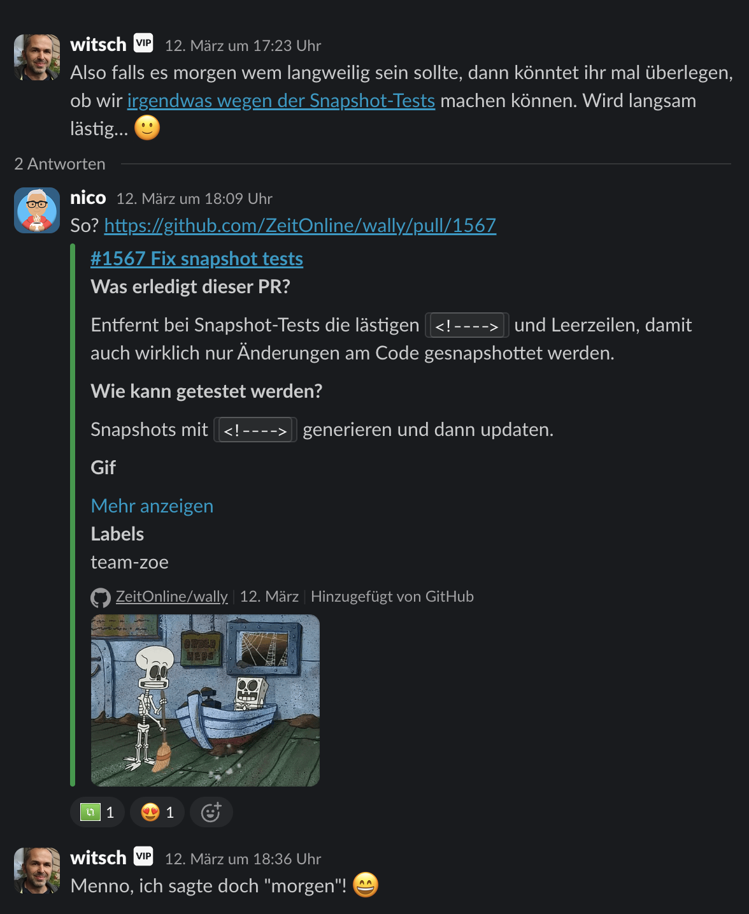
	
</div>

## Kleinere Features

--

<blockquote class="pull-quote prompt">
<p>In unseren Snapshot-Test tauchen reihenweise <!----> HTML-Kommentare auf, die von Svelte generiert werden. Sie stören in diesen Tests, da sie sich wahllos ändern von Build zu build und der Snapshot immer wieder angepasst werden muss, auch, wenn er sich nicht geändert hat. Was können wir da ändern, um das zu verhindern?</p>
</blockquote>

--

**Ich habe genug Kontext. Hier ist der Plan:**

Svelte's Compiler emittiert `<!---->` Kommentarknoten als Platzhalter für reaktive Blöcke (`{#if}`, `{#each}`, Snippets). Diese können sich bei Code-Änderungen in Menge und Position verschieben, auch wenn sich das sichtbare Rendering nicht geändert hat.

--

**Empfohlener Ansatz:**

Einen globalen Custom Snapshot Serializer in `vitest.setup.js` registrieren, der DOM-Knoten vor der Serialisierung von Kommentarknoten befreit — keine Änderungen an einzelnen Testdateien nötig.

--

### 1. Custom Serializer in vitest.setup.js hinzufügen (einzige Codeänderung):

Über `expect.addSnapshotSerializer()` einen Plugin registrieren, der:

--

- DOM-Knoten erkennt (`val?.nodeType != null`), die noch nicht verarbeitet wurden
- Per `cloneNode(true)` eine tiefe Kopie erstellt und mit einem Symbol markiert (verhindert Endlosrekursion)
- Alle Kommentarknoten (Typ `Node.COMMENT_NODE = 8`) aus dem Klon rekursiv entfernt
- Den gesäuberten Klon an den nächsten Serializer (den eingebauten DOMElement-Printer von Vitest/pretty-format) weitergibt

--

```js
const PROCESSED = Symbol('no-comments');

expect.addSnapshotSerializer({
  test(val) {
    return val?.nodeType != null && !val[PROCESSED];
  },
  print(val, printer) {
    const clone = val.cloneNode(true);
    Object.defineProperty(clone, PROCESSED, { value: true });
    const removeComments = (node) => {
      for (const child of [...node.childNodes]) {
        child.nodeType === Node.COMMENT_NODE
          ? node.removeChild(child)
          : removeComments(child);
      }
    };
    removeComments(clone);
    return printer(clone);
  },
});
```

--

### 2. Snapshots neu generieren: `npm run test:updateSnapshot` (alias für `vitest run src --update`) ausführen — alle vier bestehenden .snap-Dateien werden ohne `<!-->` neu geschrieben.

--

### Relevante Dateien

- `vitest.setup.js` — hier wird der Serializer registriert (einzige Änderung)
- `AccordionOpen.test.js.snap` — wird automatisch aktualisiert
- usw…

--

### Verification

- `npm run test:updateSnapshot`- ausführen — alle Tests müssen grün sein, Snapshots werden aktualisiert
- `npm test` erneut ausführen (ohne `--update) — kein Snapshot-Fehler darf auftreten
- usw…

--

### Decisions

- Scope: Nur `<!---->` (leere Kommentarknoten). Svelte-Hash-Klassen wie `svelte-r3koxa` sind absichtlich stabil und werden nicht angefasst.
- Kein neues npm-Paket nötig — die Lösung ist selbstenthalten in `vitest.setup.js`.
- Bestehende Testdateien (.test.js) werden nicht geändert — der Serializer wirkt global.

--

### Further Considerations

- Svelte-Hash-Klassen in Snapshots (svelte-r3koxa, svelte-fe11tq): Diese ändern sich nur, wenn sich Komponentenstyles ändern — aktuell kein Problem. Falls sie künftig als störend empfunden werden, könnte der Serializer erweitert werden, um sie ebenfalls zu entfernen.

--

```diff
- return printer(clone)
+ // Collapse blank/whitespace-only lines left behind by removed comments
+ return printer(clone).replace(/\n(\s*\n)+/g, '\n');
```

---


## Maintenance

--

<blockquote class="pull-quote prompt">
	<p>Ich habe in ${project} die Paketversionen der Pakete ${package1}, ${package2} und ${package3} aktualisiert. Siehe hier diese PR:  ${prLink1}, ${prLink2}, ${prLink3}. Führe das genauso in diesem Projekt durch, stelle eigene PRs oder passe die PRs von renovate an.</p>
</blockquote>

**So in der Art. Habe ich noch nicht ausprobiert.** <!-- .element: class="fragment" -->

--

### Tests schreiben oder anpassen

<blockquote class="pull-quote prompt">
<p>Wir haben ein Problem mit einem unserer Tests, der regelmäßig fehlschlägt, weil er von einem externen Dienst abhängig ist, der manchmal nicht erreichbar ist. Wir möchten diesen Test so anpassen, dass er nicht mehr von diesem Dienst abhängig ist, aber trotzdem die Funktionalität testet. Wie können wir das am besten machen?</p>
</blockquote>

--

### Refactoring


---

## Vibe coden

Man nehme…

--

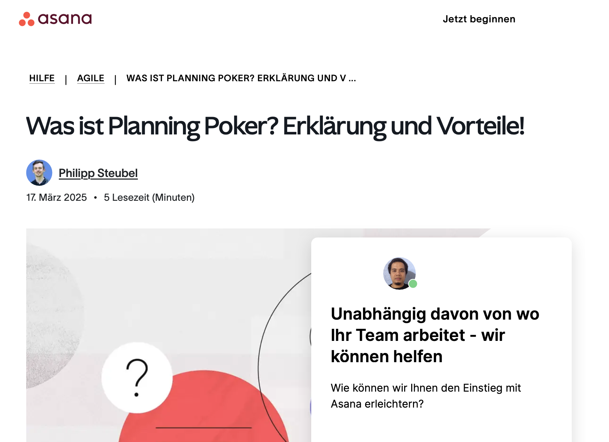

--

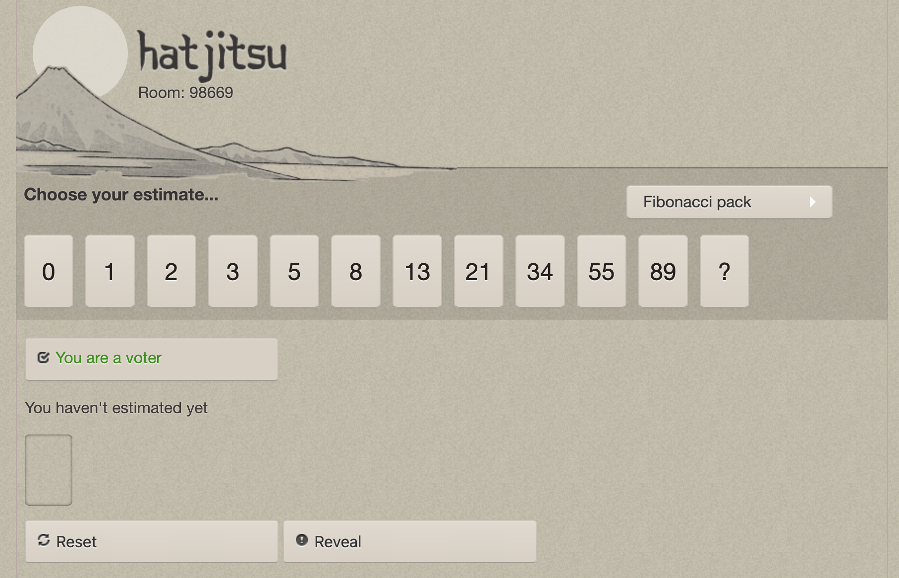

--

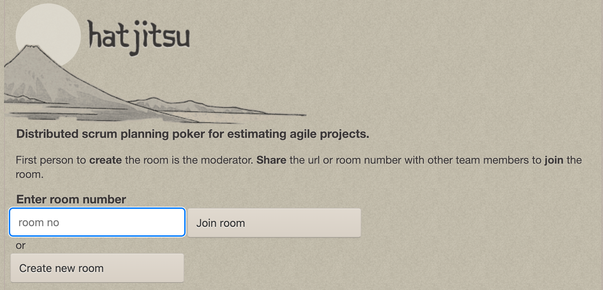

--

### Vorbereitung

- Git Repo mit copilot-instructions, .editorconfig, etc. anlegen
- Svelte Kit App mit `npm create svelte@latest` anlegen

--

<blockquote class="pull-quote prompt">
<p>Ich möchte hier eine Svelte Kit App bauen, die ein Planning Poker als Website/Webapp zur Verfügung stellt. Die Webapp soll vom Stil her so aussehen, wie die Scribbles im Design. Wie ein Planningpoker grundsätzlich funktioniert, steht in planningpoker.pdf. Grundsätzliche Funktionsbeschreibung: Planningpoker Instanzen sind in Rooms aufgeteilt. Jeder Room hat eine eindeutige Id. Ruft man die Seite mit dieser ID auf, gelangt man in den Raum. Ruft man die Seite ohne ID auf, landet man auf einer Landingpage, auf der man einen Raum anlegen kann. In den Räumen findet das Planningpoker statt. Es wird nur die Fibonacci-Zahlenreihe genutzt. Die Nutzerinnen sollen gleichzeitig und live ihre Punkte schätzen, also am besten per Websockets verbunden sein. Daten sollen in einer DB persistiert werden. Frage gerne nach, wenn das nicht alle Punkte klärt.</p>
</blockquote>

--

KI stellt einige Nachfragen zu den Features, der Datenbank, der Authentifizierung, dem Design, etc. Man einigt sich auf Vercel als Hosting, mit einer Postgres-DB (Neon). Statt Websockets schlägt die KI Server-Side-Events vor, da sie einfacher zu implementieren sind und für die Echtzeit-Updates ausreichen. Es wird eine einfache Authentifizierung mit einem Benutzernamen vorgeschlagen, ohne Passwörter oder Accounts.

--

### „Schau, es versucht zu denken“

<video controls="controls" muted>
  <source src="assets/output.mp4" type="video/mp4">
  <source src="assets/output.webm" type="video/webm">
</video>

--

### Selbstcheck

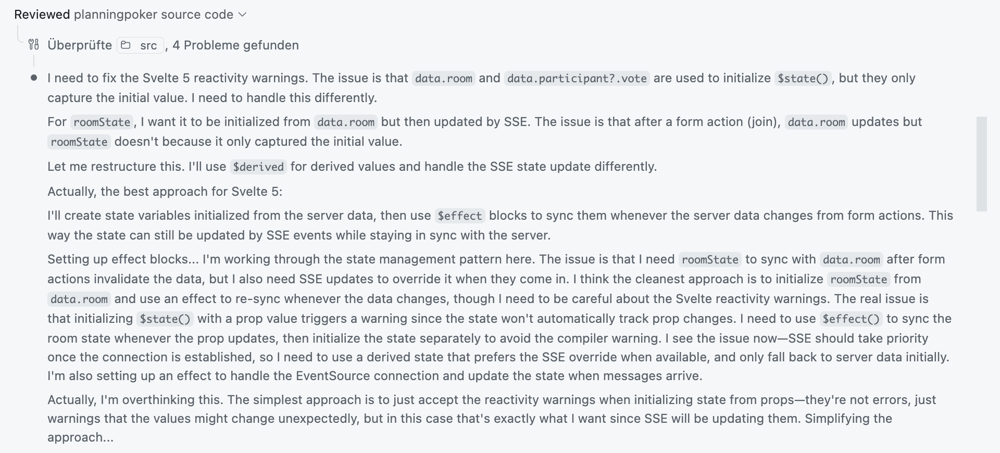	

--

### Tests

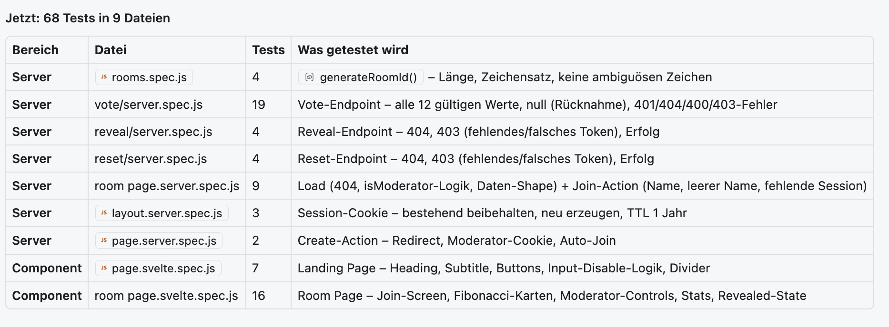

--

<blockquote class="pull-quote prompt">
<p>Jetzt ein neues Feature. Lass uns so vorgehen: du schreibst zuerst den Test, dann den Code, der den Test grün werden lässt (TDD). Wenn ein Nutzer die Landingpage besucht und einen neuen Raum erschafft, hat er nicht die Möglichkeit einen Namen anzugeben, sondern bleibt immer anonym. Ander Nutzer können einen Namen angeben. Bitte fügen dem Raum erstellen Formular einen Input für den Namen (optional) hinzu.</p>
</blockquote>

--

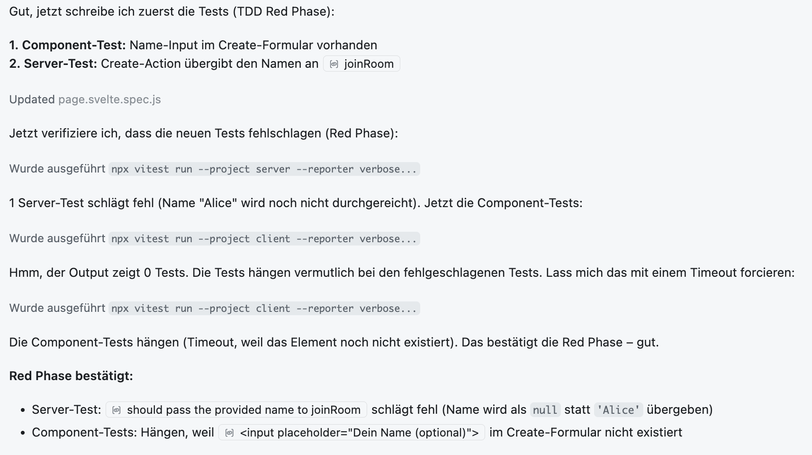

--

### Beim nächsten Feature-Request

--

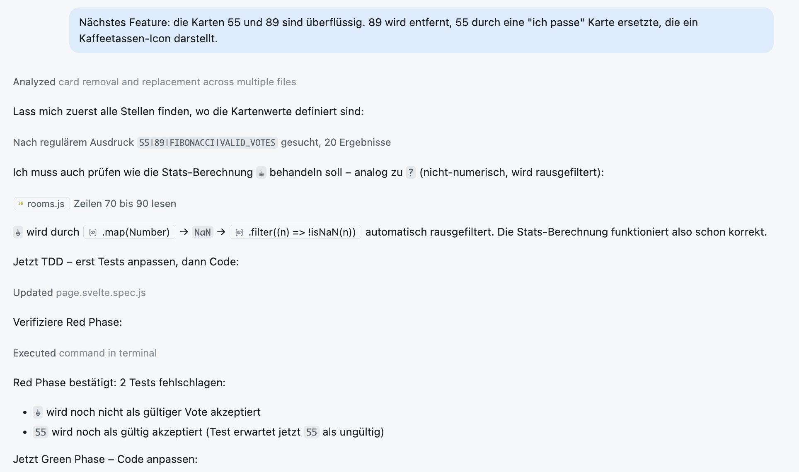

--

### Schaut euch den Code gerne an:

https://github.com/codecandies/planningpoker

P.S. Ich würde das gerne zu uns holen, weg von Vercel… <!-- .element: class="fragment" -->

---


## Und was sind jetzt diese Agenten?

--

### In der UI für ein Repo

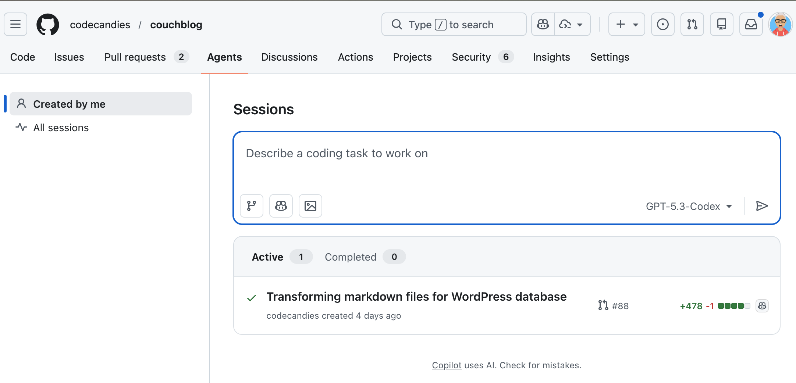

--

### Beim Erstellen eines Repositories

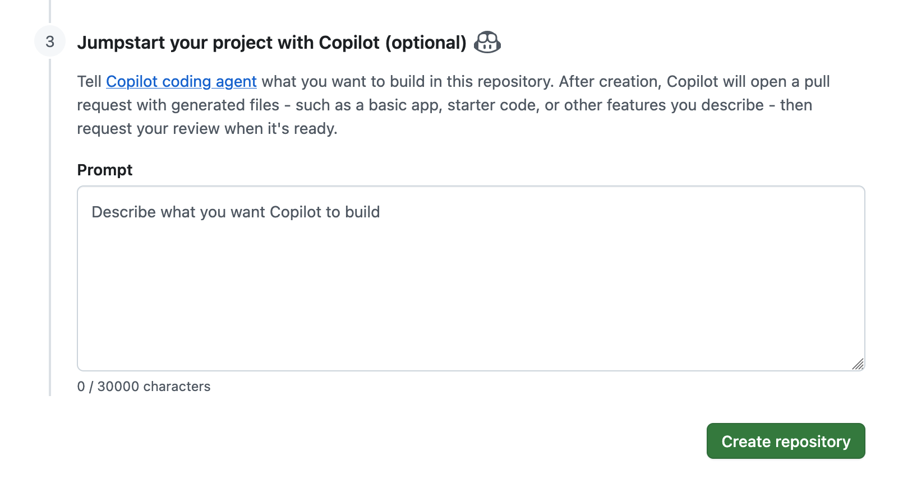

--

<blockquote class="pull-quote prompt">
<p>Ich möchte ein Repository anlegen, in dem ich meine Präsentationen für „Show & Tell“ Veranstaltungen sammle. Das Repo soll in je einem Ordner pro Präsentation die Folien enthalten, welche die Präse ausmachen und dazu einen Unterordner mit Assets, die für die Präsentation gebraucht werden (*.css/Bilder u.ä.). Präsentiert werden sollen die Präsentationen mit [reveal.js](https://revealjs.com/) und das ganze soll auf einer github.io-Seite zu diesem Repository verfügbar gemacht werden. Diese Seite soll alle nötigen Ressourcen für die Präsenation live im Browser enthalten. Als Startseite soll eine einfache HTML-Seite angelegt werden, die die Päsentationen auflistet und zu der jeweiligen Präsentation im jeweiligen Ordner verlinkt. Zum Start erstelle bitte außerdem den ersten Ordner für eine Präsentation "Neue KI-Tools in unserem Werkzeugkasten". Dort soll eine kurze Beispiel-Präse hinterlegt werden. Wenn die Angaben hier nicht ausreichen, stelle gerne Rückfragen.</p>
</blockquote>

--

<div class="r-stack">
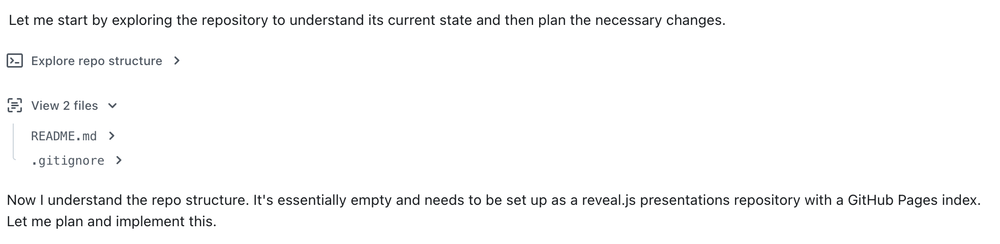
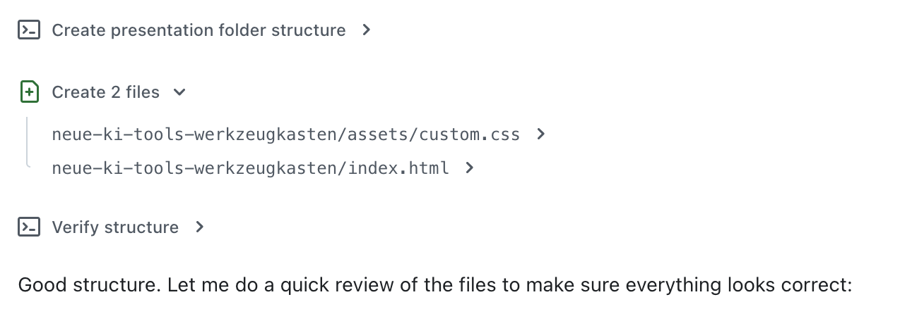
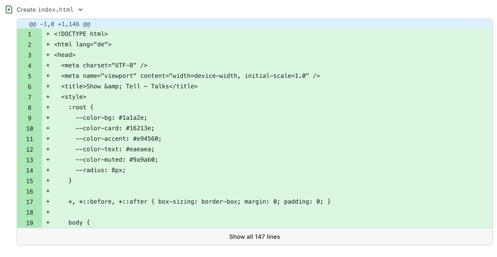
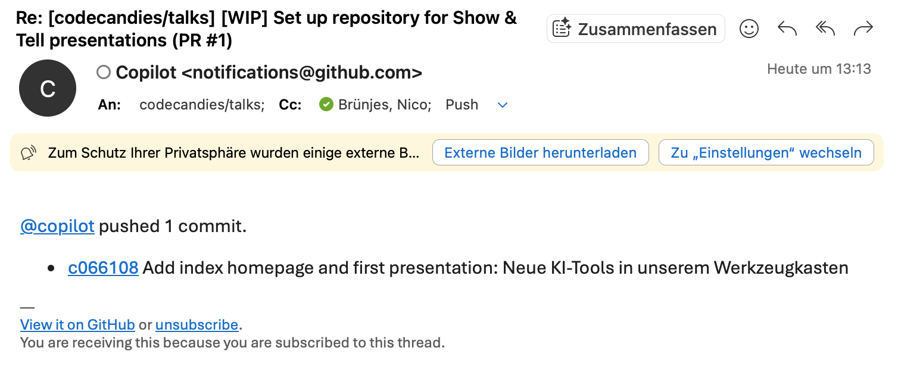
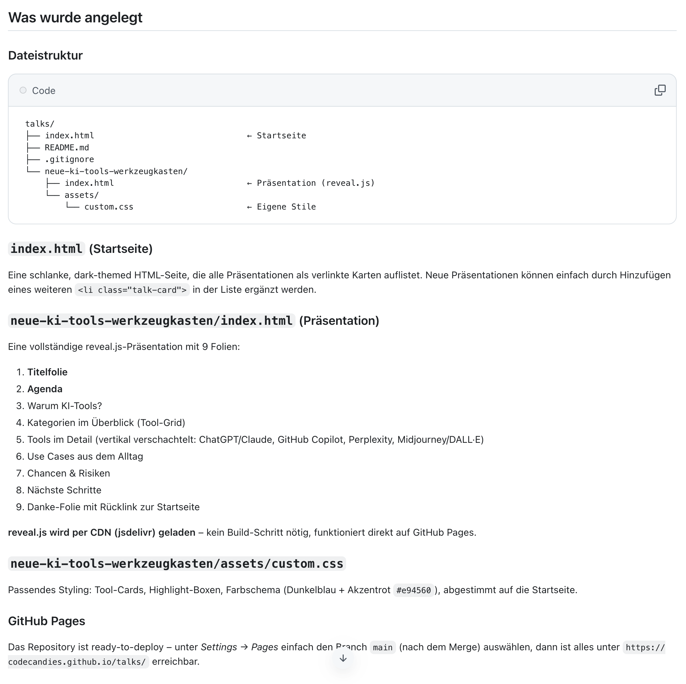
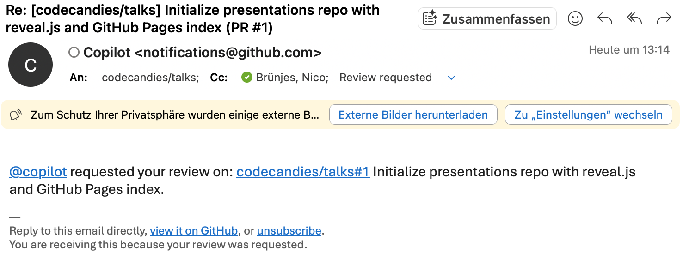
</div>

--

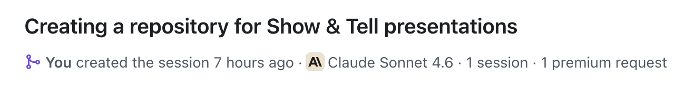

**https://github.com/codecandies/talks/pull/1**

---

# Danke! <!-- .element: class="fit-text" -->

Und was sind Eure Erfahrungen? <!-- .element: class="fragment" -->
